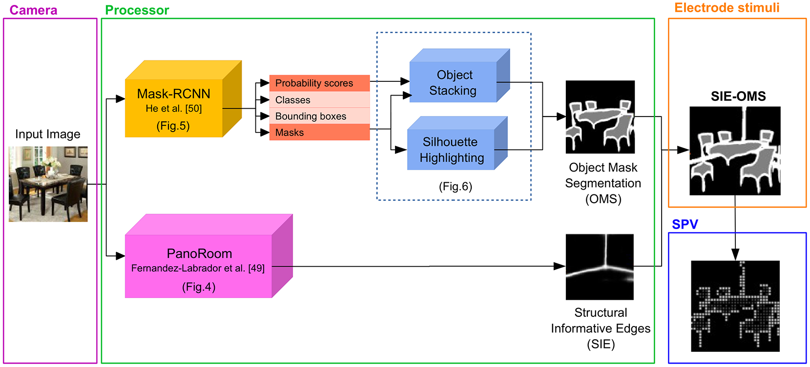
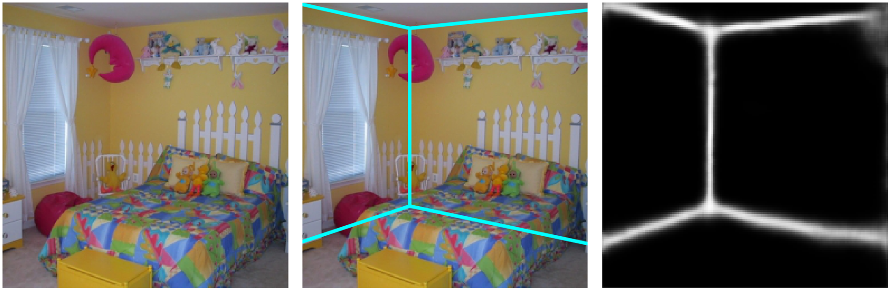
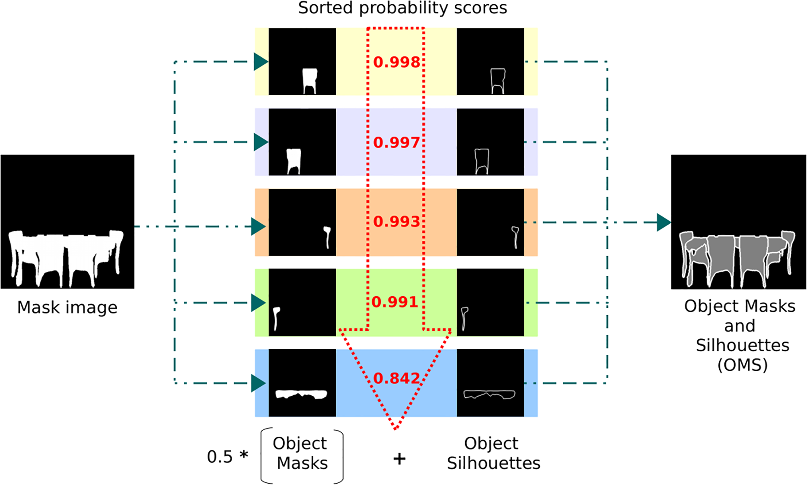

# Semantic and Structural Image Segmentation for Prosthetic Vision

Prosthetic vision is being applied to partially recover the retinal stimulation of visually impaired people. However, the phosphenic images produced by the implants have very limited information bandwidth due to the poor resolution and lack of color or contrast. Here we propose a new visual stimuli called SIE-OMS based on semantic segmentation for indoor scene understanding using visual prosthesis.

<p align="center">

</p>


- To run the code:
```
generate_schematic_images.py
``` 

# Structural Informative Edges (SIE)
For Structural Informative Edges, we use the framework of [PanoRoom](https://arxiv.org/pdf/1808.09879.pdf) (Fernandez-Labrador et al.) which uses a Fully Convolutional Network (FCN) for pixel classification to estimate probability maps representing the room structural edges. 

<p align="center">

</p>

- To run the code in SIE folder:
```
persp_predict.py
```

# Object Mask and Silhouettes (OMS)
For Object Mask and Silhouettes, we perform instance segmentation of objects using the architecture of [Mask R-CNN](https://github.com/matterport/Mask_RCNN) (He et al.). Using selective search, it identifies a manageable number of bounding-box object region candidates (ROI). Then, it extracts CNN features from each region independently for classification and extract a binary mask in pixel level of the object.

<p align="center">

</p>

- To run the code download the [Mask R-CNN](https://github.com/matterport/Mask_RCNN) and run the following file:
```
generate_objects_image.py
```

# SIE-OMS
The final representation of the SIE-OMS method is a superposition of both parts, SIE and OMS, always assuming the edges as background and object masks as foreground. Finally, we use a simulated phosphene map on a computer screen, but the same activation images could be directly applied to the retinal implant.

- To run the code:
```
generate_phosp_image.py
```

You can find more details in S1 Appendix [Supplementary material](https://journals.plos.org/plosone/article?id=10.1371/journal.pone.0227677).

Check the [Project Page](https://github.com/mesangar/SIE-OMS) for more details!

## Related Research
Please cite [this paper](https://journals.plos.org/plosone/article?id=10.1371/journal.pone.0227677) in your publications if it helps your research, ``[Sanchez-Garcia et al.2020]``.

```bibtex

@article{sanchez2020semantic,
  title={Semantic and structural image segmentation for prosthetic vision},
  author={Sanchez-Garcia, Melani and Martinez-Cantin, Ruben and Guerrero, Jose J},
  journal={PloS one},
  volume={15},
  number={1},
  pages={e0227677},
  year={2020},
  publisher={Public Library of Science San Francisco, CA USA}
}
```
## License 
This software is under GNU General Public License Version 3 (GPLv3), please see [GNU License](http://www.gnu.org/licenses/gpl.html).

For commercial purposes, please contact the authors.
